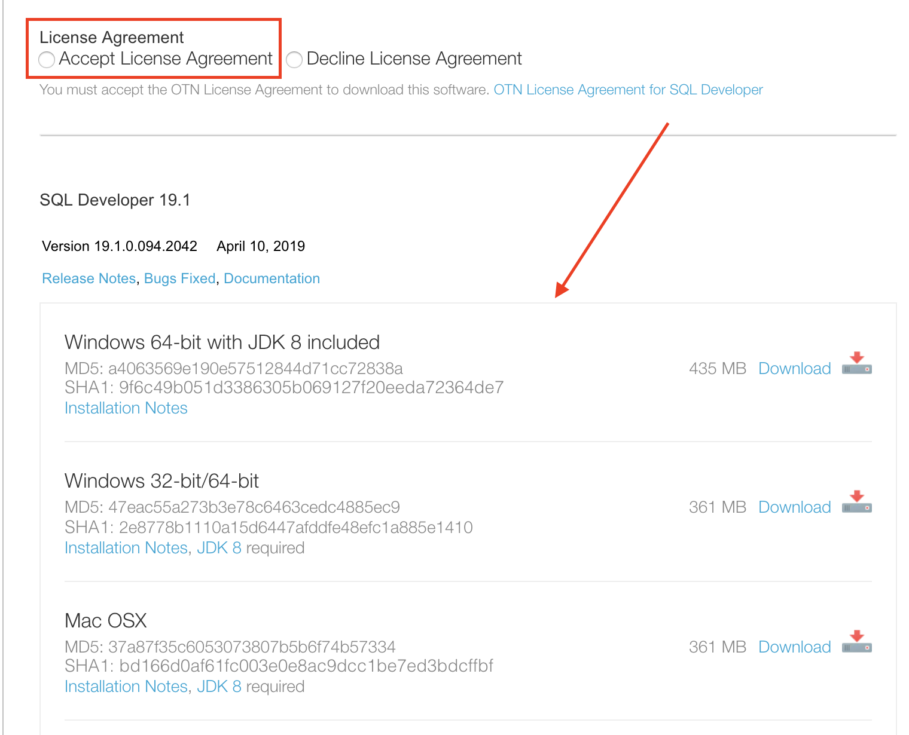
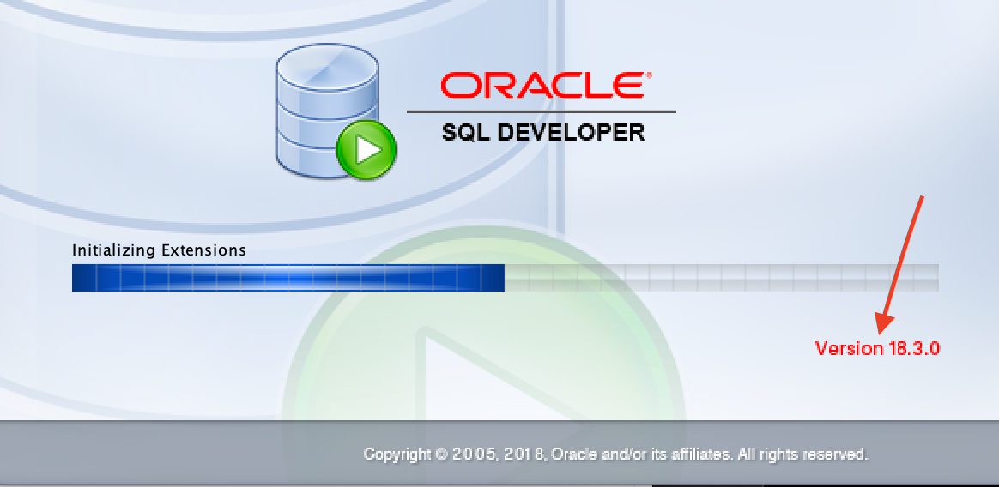

#  Oracle Autonomous Data Warehouse: Departmental Reporting 

Updated May 13 2019

## Introduction

This workshop walks you through all the steps to get started using the **Oracle Autonomous Data Warehouse (ADW)** for departmental reporting. You will provision a new ADW instance, load data from excel sheets, manage an ADW instance, scale an ADW instance, and use Oracle Analytics Cloud to build visualizations.

**Objectives**

-   Provision a new ADW instance

-   Load data

-   Manage and Monitor an ADW instance

-   Scale an ADW instance

-   Use Oracle Data Visualization Cloud with ADW

**How to Get Your Free Cloud Trial Account**

> If you already have an Oracle Cloud account then you can skip this section. If you don't have an Oracle Cloud account then you can quickly and easily sign up for a free trial account that provides:\
> \$300 of free credits good for up to 3500 hours of Oracle Cloud usage\
> Credits can be used on all eligible Cloud Platform and Infrastructure services for the next 30 days\
> Your credit card will only be used for verification purposes and will not be charged unless you 'Upgrade to Paid' in My Services
>
> 
>
> Once your trial account is created, you will receive a Welcome to Oracle Cloud email that contains your cloud account password along with links to useful collateral. Click here to sign into the Oracle Cloud, go to: [*https://cloud.oracle.com*](https://myservices.us.oraclecloud.com/mycloud/signup?language=en&sourceType=:ex:tb:::RC_NAMK181017P00031:ADW_IMHOL&SC=:ex:tb:::RC_NAMK181017P00031:ADW_IMHOL&pcode=NAMK181017P00031)

**Before You Begin**

> **What is an Autonomous Data Warehouse?**
>
> Oracle Autonomous Data Warehouse provides an easy-to-use, fully autonomous database that scales elastically, delivers fast query performance and requires no database administration.
>
> Oracle’s Autonomous Data Warehouse is the perfect quick-start service for fast data loading and sophisticated data reporting and analysis. Oracle manages everything for you so you can focus on your data.
>
> Read on to begin ‘Getting Started journey with Oracle Autonomous Data Warehouse’.
>
> **Lab Prerequisites**\
> This workshop needs a desktop tool to be installed on your computer to do the exercises in this lab.
>
> *1. SQL Developer*\
> To download and install SQL Developer please follow [*this link*](http://www.oracle.com/technetwork/developer-tools/sql-developer/downloads/index.html), and select the operating system for your computer. This page also has instructions on how to install SQL Developer on Windows, Mac OSX and Linux.
>
> First you must accept the license agreement and then choose the version of SQL Developer based on your operating system.

>
> If you already have SQL Developer installed on your computer then please check the version - The recommended version is 18.3 or higher as this version contains enhancements for key Autonomous Data Warehouse features, including using ADW behind a VPN or Firewall, you can check the version by simply opening up SQL Developer and as the application loads you can see the version to the right.
> 

> *2. Data Files*\
> To download go to the GitHub repository and download ‘**EXPENSE\_SUMMARY.xlsx**’ and ‘**FINANCIAL\_SUMMARY.xlsx**’
>
> **Getting Help During This Workshop**\
> 
>
> ***Cloud Customer Connect*** https://go.oracle.com/cloudcoach.
>

###  **Navigate to Lab 100**

- _You can see a list of Lab Guides_ by clicking on the **Menu Icon** in the upper left corner of the browser window. You're now ready to continue with **Lab 100**.

  
