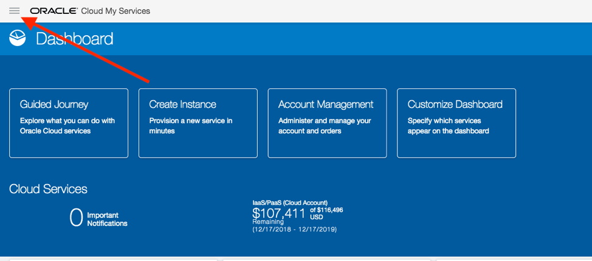
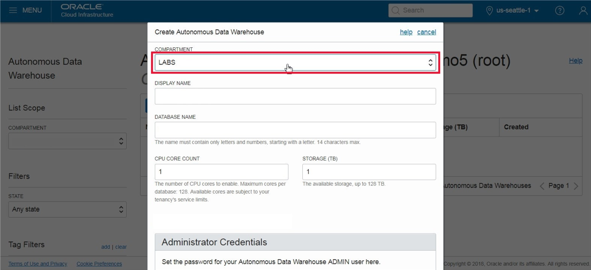

Updated May 13 2019

# Lab 100: Getting Started and Provisioning a New Autonomous Data Warehouse

## Introduction
 This lab walks you through the steps of logging into the Oracle Cloud, accessing the Oracle Autonomous Data Warehouse console and provisioning your first Autonomous Data Warehouse. The last part of this lab will explore how to connect to your new data warehouse using Oracle SQL Developer.

 ## Objectives

-   Learn how to sign-in to the Oracle Public Cloud

-   Learn how to provision a new Autonomous Data Warehouse instance

-   Learn how to download the client credentials wallet file

-   Learn how to connect from Oracle SQL Developer

Required Artifacts
------------------

-   The following lab requires an Oracle Cloud account. You may use your own cloud account, a cloud account that you obtained through a trial, or a training account whose details were given to you by an Oracle instructor.

-   Oracle SQL Developer

Part 1. Provisioning an ADW Instance
====================================

 In this section you will be provisioning an ADW instance using the cloud console.

### STEP 1: Sign in to Oracle Cloud

 Go to [cloud.oracle.com](https://cloud.oracle.com/), click **Sign In** to sign in with your Oracle Cloud account.

 

 Enter your **Cloud Account Name** and click next.

 Enter your Oracle Cloud **username** and **password**, and click **Sign In**.

 

#### STEP 2: Create an ADW Instance

 Once you are logged in, you are taken to the cloud services dashboard where you can see all the services available to you. Click the hamburger menu on the top left-hand side 

 

 Select Services then select **Autonomous Data Warehouse.**

 

 Under compartment dropdown on the left select your **root compartment** where you will create your new ADW instance.

 
 You can also see your current default **region** in the top, right hand corner of the page or you can select a region that is closer to where you are located.

 

 Click on **Create Autonomous Data Warehouse** button to start the instance creation process.

 This will bring up the Create Autonomous Data Warehouse screen where you will specify the configurations of the instance. Select the root compartment, or another compartment of your choice.

 

 Specify a memorable display name for the instance like **ADW Finance Mart**. Also specify your database's name, for this lab you could use **ADWFINANCE**.

 

 Next, select the number of CPUs and storage size. Here, we use 4 CPUs and 1 TB of storage.

 

 Then, specify an **ADMIN** password for the instance, and a confirmation of it. Make a note of this password.

 

 For this lab, we will select **Subscribe To A New Database License**. If your organization owns Oracle Database licenses already, you may bring those licenses to your cloud service.

 Make sure everything is filled out correctly, then proceed to click on **Create Autonomous Data Warehouse**.

 

 Your instance will begin provisioning. Once the state goes from Provisioning to Available, click on your display name to see its details. Note: this will take about 5-10 minutes.

 You now have created your first Autonomous Data Warehouse instance. Have a look at your instance's details here including its name, database version, CPU count and storage size. Stay on the details page as we will be using it for the next lab.

 

Part 2. Connecting to ADW
=========================

Downloading the Connection Wallet
---------------------------------

 As ADW only accepts secure connections to the database, you need to download a wallet file containing your credentials first. A wallet is a password-protected file that holds your credentials, downloading this will let you connect ADW to various systems. The wallet can be downloaded either from the instance's details page, or from the ADW service console.

 In your database's instance details page, click **DB Connection**.

 

 Under Download a Connection Wallet, click **Download**.

 

 Specify a password of your choice for the wallet. You will need this password when connecting to the database via SQL Developer later. Click **Download** to download the wallet file to your client machine.\
 *Note: If you are prevented from downloading your Connection Wallet, it may be due to your browser's pop-blocker. Please disable it or create an exception for Oracle Cloud domains.*

 

Creating instance of OAC
------------------------

 We are not yet going to connect to OAC, however right now would be a good time to create an instance of OAC for later labs. From your ADW dashboard click on the hamburger menu at the top left and then scroll down to ‘**My Services Dashboard’** and click on it.

This will bring us back to our Cloud Dashboard, from here click on the hamburger menu again, click on ‘Services’ then click on ‘Analytics’

From here click on create instance. 

Then fill in the instance name, let’s just call it Financial. Then next to the Instance Name box click on the Feature Set drop down and choose Data Visualization then press **Next**. 

Then click Create and you have just made yourself an instance of OAC. 

## Connecting to the database using SQL Developer

 Start SQL Developer and create a connection for your database using the default administrator account '**ADMIN**' by following these steps.

 Click the **New Connection** icon in the Connections toolbox on the top left of the SQL Developer homepage.

 

 Fill in the connection details as below:

 -	Connection Name: admin_high
-	Username: admin
-	Password: The password you specified during provisioning your instance of ADW
-	Connection Type: Cloud Wallet
-	Configuration File: Enter the full path for the wallet file you downloaded before, or click the Browse button to point to the location of the file.
-	Service: There are 3 pre-configured database services for each database. Pick {database}_high for this lab. For
example, if the database you created was named adwfinance, select adwfinance_high as the service.

 

 Test your connection by clicking the **Test** button, if it succeeds save your connection information by clicking **Save**, then connect to your database by clicking the **Connect** button. An entry for the new connection appears under Connections.

 **Note**: If you are behind a VPN or Firewall and this Test fails, make sure you have [SQL Developer 18.3](https://www.oracle.com/technetwork/developer-tools/sql-developer/downloads/index.html) or higher. This version and above will allow you to select the "Use HTTP Proxy Host" option for a Cloud Wallet type connection. While creating your new ADW connection here, provide your proxy's Host and Port. If you are unsure where to find this, you may look at your computer's connection settings or contact your Network Administrator.

 

 Then put in your password and press ok to finish making the connection.

 
