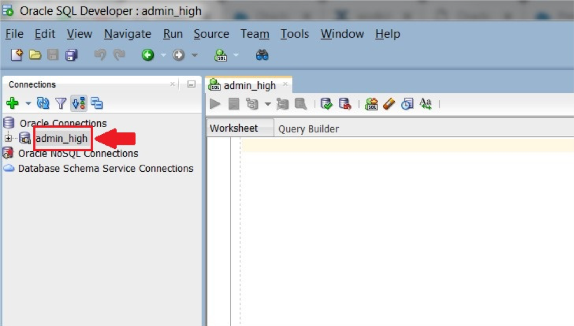
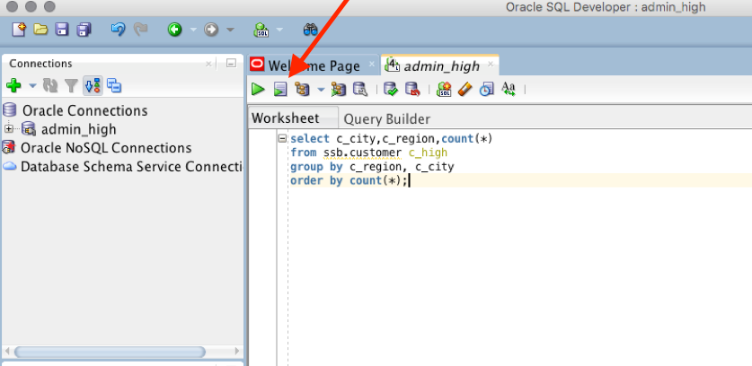
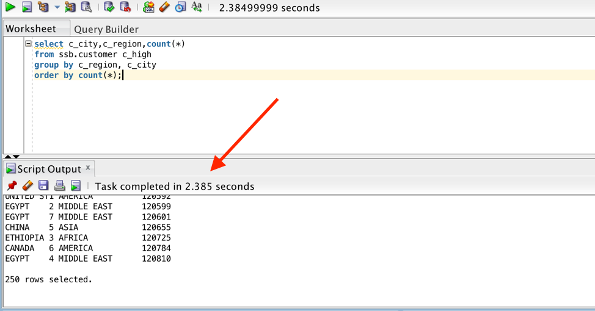

Updated: May 13th 2019

# Lab 200: Working with Data Warehouse Services and the Free Sample Data Sets

## Introduction
 In this lab you will explore the free sample data sets that are included within your new autonomous data warehouse. As part of this lab you will experiment with the selecting different levels of database services that come with your Autonomous Data Warehouse.

 **Key Objectives**:

-   Learn about the different levels of Autonomous Data Warehouse service (HIGH, MEDIUM, LOW)

-   Learn about the Star Schema Benchmark (SSB) and Sales History (SH) sample data sets

-   See how the different levels of database service affect performance and concurrency

Introduction
------------

 In this lab you will explore the provided sample data sets and learn more about the choices of database services that come with your ADW instance.

 Autonomous Data Warehouse provides three database services that you can choose when connecting to your database. These are named as HIGH, MEDIUM, and LOW services and provide different levels of performance and concurrency.

The **HIGH** database service provides the maximum amount of CPU resources for a query; however this also means the number of concurrent queries you can run in this service will not be as much as the other services. The number of concurrent SQL statements that can be run in this service is 3, this number is independent of the number of CPUs in your database. \
\
The **MEDIUM** database service provides multiple compute and IO resources for a query. This service provides more concurrency compared to the HIGH database service. The number of concurrent SQL statements that can be run in this service depends on the number of CPUs in your database and scales linearly with the number of CPUs. \
\
The **LOW** database service provides the least amount of resources for a query, and any number of concurrent queries you can run in this service. 

 As a user you need to pick the database service based on your performance and concurrency requirements.

 The lab will use a HIGH database service to understand the performance and will demo queries on sample data sets provided out of the box with ADW. ADW provides the Oracle Sales History sample schema and the Star Schema Benchmark (SSB) data set, these data sets are in the SH and SSB schemas respectively.

 You will run a basic query on the SSB data set which is a 1TB data set with one fact table with around 6 billion rows, and several dimension tables.

Required Artifacts
------------------

-   The following lab requires an instance of ADW as well as SQL Developer

#### 

Steps
-----

#### 

#### STEP 1: Test the connection 

-   You can do this via expanding the list of connections and double-clicking on the admin\_high connection.

 

 Copy and paste this code snippet to your SQL Developer worksheet. This query will run on the Star Schema Benchmark, one of the two ADW sample data sets that may be accessed from any ADW instance. Take a moment to examine the script. Then click the **Run Script** button (the button that the red arrow is pointing at in the screen shot below) to run the script.

 

 Take a look at the output response from your Autonomous Data Warehouse as well as the response time.

 When possible, ADW also **caches** the results of a query for you. If you run identical queries more than once, you will notice a much lower response time when your results have been cached.

  -------------------------------------------------------------------------------------------------------------------------------------------------------------------- -----------------------------------------------------------------------------
## Great Work - All Done!
                                                                                              
  You are ready to move on to the next lab. You may now close this tab.**
  -------------------------------------------------------------------------------------------------------------------------------------------------------------------- -----------------------------------------------------------------------------