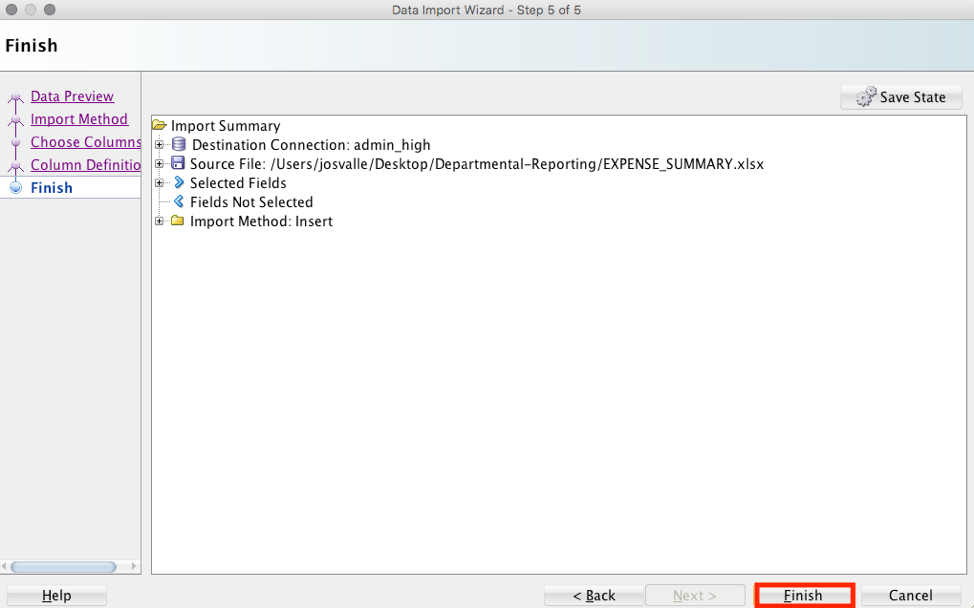

Updated: May 13 2019

# Lab 300: Loading Data into Your New Autonomous Data Warehouse**

## Introduction
 In this lab, you will be uploading files to your ADW and creating tables. You can load data into your new Autonomous Data Warehouse using Oracle Database tools, Oracle, and 3rd party data integration tools.

Objectives
----------

-   Learn how to use the SQL Developer Data Import Wizard

-   Learn how to create tables in your database

Download Sample Data
====================

#### STEP 1: Download the Sample Data Files to Your Local Computer

 For this lab, you will need a handful of data files, which are in the files folder of the lab. 

Load data from the local file system
====================================

#### STEP 2: Loading Data Using the Data Import Wizard in SQL Developer

 Click ‘**Tables**’ in your user schema object tree. Right click the mouse which opens the context-sensitive menu in SQL Developer; select ‘**Import Data**’:

 

 The Data Import Wizard will start, then click next to **Source** and select **Local File.** Click the browse button and navigate to the ‘**EXPENSE\_SUMMARY.xlsx’** file that you downloaded in the beginning of the lab. 

After selecting the file, you can preview the data and select the appropriate file formats. You will see that the data preview is interactive and changes according to your selection.

 When you are satisfied with the file content view, click **NEXT**.

 On Step 2 of the Import Wizard, you control the import method and parameters. Leave the Import Method as Insert. Enter **EXPENSE\_SUMMARY** as your target table name, this table will be created by the import wizard. Click **NEXT**.

 

 The Choose Columns screen lets you select the columns you want to import. Leave the defaults and click **NEXT**. 
 
 

 The column definition screen allows you to set the column names and data types for your new table, basically letting you customize the columns before uploading the data. You can change these if you need to. For this exercise leave them as default and click **NEXT**.

 

 The final screen reflects all your choices made in the Wizard. Click **FINISH** to load the data into your newly created table **EXPENSE\_SUMMARY**. If you don't see it in your object tree under Tables, right click on Tables and hit refresh.
 
 

Lastly press ok in the next pop up box

 

  -------------------------------------------------------------------------------------------------------------------------------------------------------------------- -----------------------------------------------------------------------------
  ## Great Work - All Done!