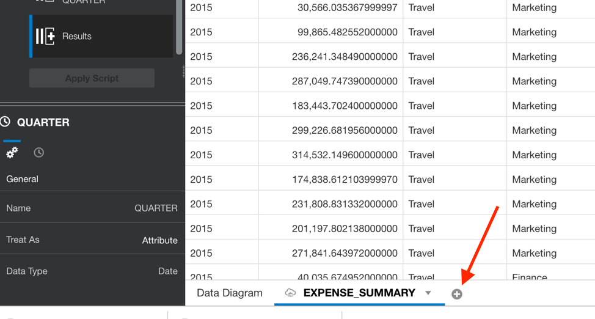

Updated: May 13 2019

# Lab 400: Creating Rich Data Visualizations

## Introduction
 This lab will walk you through the process of connecting your Autonomous Data Warehouse to OAC to build sophisticated data visualizations to help your business teams get deeper insights about their data.

Objectives
----------

-   Learn how to connect a cloud analytics tool to the powerful Autonomous Data Warehouse

-   Learn how to create a simple data visualization project with Oracle Data Visualization

-   Learn how to access and gain insights from data in the Autonomous Data Warehouse

Required Artifacts
------------------

-   Access to your OAC instance

-   Access to your Autonomous Data Warehouse instance

-   Wallet file from previous lab

Create a Connection to Your Autonomous Data Warehouse from Data Visualization Desktop
=====================================================================================

Now we need to go to our instance of OAC that we created earlier. Open a new tab and go back to the dashboard. Once here open up the hamburger menu at the top left.

From here click on services and then click on analytics.

Now that we are back in the analytics dashboard, click on the hamburger menu to the right of our **Financial** instance and then click on **Oracle Analytics Cloud URL.**

When Oracle Data Visualization opens, click on the **‘Create’** button and select **‘Connection’**.

In the Create Connection Dialog, select the highlighted option for **‘Oracle Autonomous Data Warehouse’**.

  

 Next there will be a pop up, fill in the fields. Let’s name the connection **DEP\_REPORTING**, then for client credentials select our wallet file. Finally put in your user name **admin** and whatever password you set for yourself earlier. (Note: this is the same credentials we used to connect SQL Developer to ADW). After all the fields are filled in click **Save.**

 

 Upon success of creating a new connection to the Autonomous Data Warehouse, select the **Create** button and select **Data Set**.

 

 We will now choose to select the sales data we want to analyze and visualize in our first project. Select the connection we just created named **DEP\_REPORTING**.

 

 Click on the **ADMIN** schema in the data warehouse.

 
 Find and Click on **EXPENSE\_SUMMARY**.

 

 First click on the **Add All** Label in the left column.\
 

 Type a new Name for the Data Set in the top right and call it **‘EXPENSE\_SUMMARY**. Click on the **Add** button to add the Data Set.

 Once the **EXPENSE\_SUMMARY** Data Set has successfully been created, click on **Create Project**.

 

 Select the **Prepare** menu option on the top right.

 

We are going to override the data types for the **YEAR** column recognized as measures (i.e. numeric), and correct them to be treated as a time – Hover right next to **YEAR** and you will see a hamburger menu, click on the menu and then click ‘**Convert to Date**’.

 

 Then click on **Add Step**.

 

 We still need to change the **Quarter** column as well, on our data scroll to the right until you see **Quarter** and then click on its hamburger menu. Click **Convert to Date**
 
 

 Then hit the **Add Step** button.

 

 Lastly, we will need to click ‘Apply Script’ to the left to save the changes we have made.

 

 Next, we are going to import another data set, click the plus sign at the bottom of the page right next to **EXPENSE\_SUMMARY **

 

 Then at the next pop up click **Create Data Set**.

 

 Click on the file button, and then navigate to the files provided at the beginning of the lab and choose **FINANCIAL\_SUMMARY.xlsx.**

 Once you have added the file at the next window change the name of the data set to **FINANCIAL\_SUMMARY**, then click on the **Add** button.

 

 We need to clean this data again as our **Year** and **Quarter** columns need to be changed to dates. Let’s click on the hamburger menu next to the **Year** column and change this to a date like we did before.

 

Then click **Add Step**.

 

 Let’s repeat the last steps for **Quarter**, click on the **Quarter** hamburger menu and select **Convert to Date**.

Then click **Add Step**.

 To save the steps we made we will just need to click **Apply Script** over on the left.

 

 The last bit of data preparation we are going to do is going to be joining our data sets. Both these data sets have relations to each other and if we join them we will be able to use both data sets to create visualizations. On the bottom left next to **EXPENSE\_SUMMARY** click on **Data Diagram**

 

 Here we see two icons that represent our data sets and a line between the two of them. If we hover over the middle there will be a line and a little box that reads **0,** this signifies that we have 0 joins made across our tables. We need to change that so that we can create visualizations across both tables, click on the **0.** 

 Next click on **Add Another Match.**

 

 Now click on the drop-down menu on the left side where it says **Select Data.** 

 Choose **Region**.

 

Then repeat the process on the other right side, go to the **Select Data** drop down and choose **Region** again.

 

 We have just created a relation however, there are other columns we can use to create a stronger relation between our columns. Click on **Add Another Match. **

 

 A new row will appear and this is where we are going to pick our relating columns.

 

 Click on **Select Data** on the left column and choose **Year**, then on the right column do the same.

 

 Repeat this process for **Month**, **Quarter**, and **Cost Center** then click **Ok**.

 

 Now we are ready to create some visualizations, before we do let’s save our progress by clicking on **Save** at the top right. 
 
 

 Then naming our project **Departmental Reporting** and then clicking **Save** again.

 Now we are ready to create our first visualizations let’s click on **Visualize** at the top right and head back to the visualize page. 
 
 

 First, we want to make sure that we are looking only at data for the UK, lets create a filter. On the left in the **Data Elements** box lets open up **FINACIAL\_SUMMARY** by clicking on the arrow next it. Once expanded drag **Region** to ‘**Click here or drag data to add filter**’ for a dropdown of a filter to appear.

 

 Then click on UK.

 

 You can then just then click anywhere outside the box for the dropdown to go away.

 

 Now that we are filtering our data for the UK let’s create our first visualization. Under the **FINANCE\_SUMMARY** data element drag **Quarter**, **Operating Expenses**, and **Previous Year Operating Expenses** over to the ‘**Drop Visualization or Data Here’** area on the right.

 

 Depending on the order you dropped in your data you will probably have created a pivot table, let’s change this to something that can better show us how our expenses compare to our previous expenses. In the upper left side of the visualization area click on **Pivot** this will bring up a window showing us all the possible visualizations we can choose from. Let’s choose **Bar.** 

 The bar graph we have created shows us that our expenses compared to the previous year has slowly been increasing. There are many reasons this can happen, but let’s investigate our expenses to see if we can find increase in spending.

 

 Go back to **Data Elements** on the left and expand. **EXPENSE\_SUMMARY,** then holding down the control button (if you are on a Windows machine) or the command button (Mac users) click on **MONTH**, **OUT\_OF\_POLICY\_EXPENSE**, and **SUBCATEGORY**, then right-click to see a small pop up, then click **Create Best Visualization.**

 

 Once done you will see a visualization showing our costs for the year, here we can see that sometime in August our spending for hotels went through the roof.

 

 -------------------------------------------------------------------------------------------------------------------------------------------------------------------- ------------------------
    Great Work - All Done!
                                                                                                                                                                   
  -------------------------------------------------------------------------------------------------------------------------------------------------------------------- ------------------------
