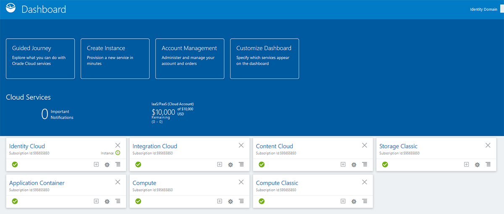
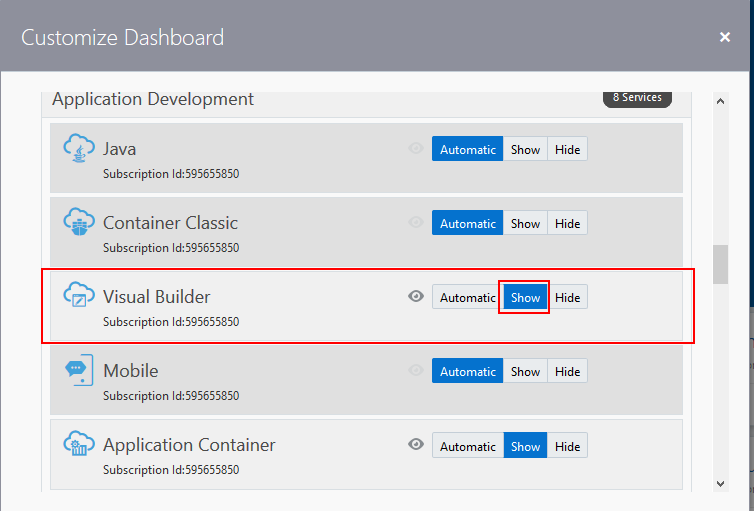
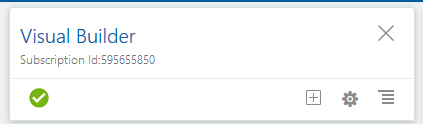
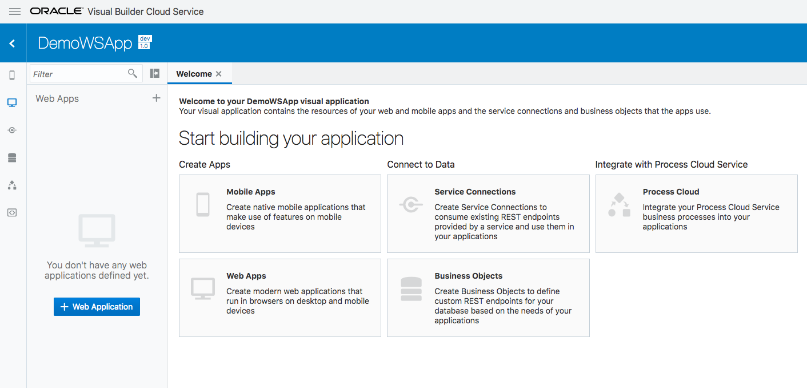
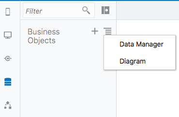
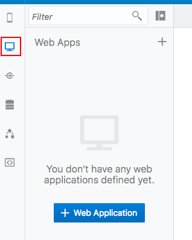
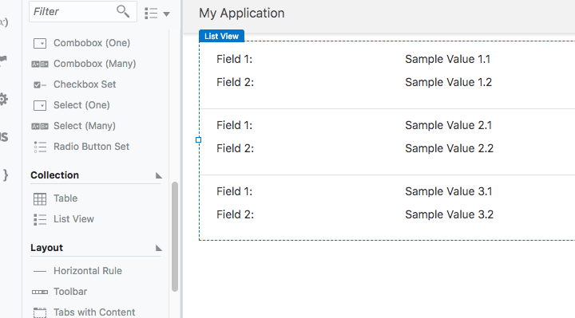
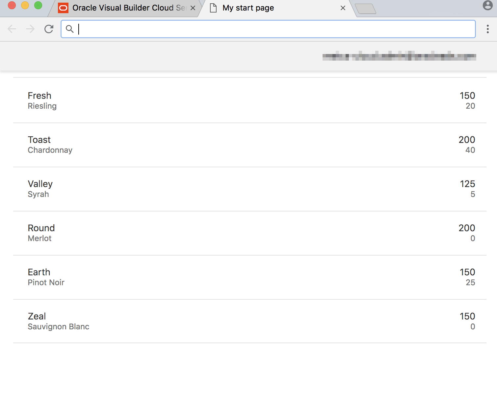

# Lab 100 - Creating a Visual Builder Application and Displaying Business Data

## Introduction

This is the first of several labs that are part of the **Oracle Autonomous Visual Builder Cloud Service Workshop.** During this workshop you will explore Oracle's Autonomous Visual Builder Cloud Service and its features from the persona of **Javascript Developer**, <add name>. You will follow <add name> as he creates a new web application, mobile application and links the mobile and web applications to the same business data in the Cloud. In our first lab you will create a Visual Builder application and add business data to display.

## Objectives

- Begin Creating a Web Application
  - Create application within Visual Builder user interface
  - Add business data for application to display
- Create the Application Pages
  - Create pages for displaying business data
  - Create pages for creating and editing business data

# Create an Application in Oracle Autonomous Visual Builder Cloud Service

### **STEP 1**: Login to your Oracle Cloud Account

- From any browser, go to the URL:
  `https://cloud.oracle.com`

- Click **Sign In** in the upper right hand corner of the browser and on the next screen enter you Cloud Account Name.

- Enter your User Name and Password provided for your trial account and click **Sign In**

    

- You will be presented with a Dashboard displaying the various cloud services available to this account.

  

- If the Visual Builder Cloud Service does not appear in your list click the customize dashboard button.

  

- Then select Visual Builder and click the show button.

- Your should see the following before proceeding to the next step.

### **STEP 2**: Access the Oracle Autonomous Visual Builder Cloud Service

Oracle Autonomous Visual Builder Cloud Service provides an easy way to
create and host web and mobile applications in a secure cloud
environment. The intuitive visual development experience on top of a
complete development and hosting platform accelerates application
creation and provisioning, leveraging an open, standard-based
architecture.

- From the Cloud UI dashboard click on the **Visual Builder** service.

  

- The Service Details page gives you a quick glance of the service status overview.

- Click **Open Service Console** for the Oracle Visual Builder Cloud Service. The Service Console will then list all Visual Applications.

  

### **STEP 3**: Create Visual Application

- Click **New** to start the application create wizard.

  

- On Details screen enter the following data and click on **Next**.

  In the Create Application dialog box, enter the following.

  - Application name: Application
  - Description: Tutorial application

  - The Application ID text field is automatically populated as you type based on the Application Name.

    

- You now have a new application, in which you can begin building pages and adding data.

  

# Import Business Data

### **STEP 1**: Import Files containing business data

#### Create Business Objects by Importing the Inventory Data

In this step you are assuming the identity of the Javascript, **_Lisa Jones_**.

- First we will import some data for our application to display. Click on the **Business Objects** icon in the left panel to open the "Business Objects" panel and click the "menu" icon next to the plus sign and click "Data Manager" to open the import tool.

  

* Now we'll import the Inventory data from a file. Click on the **Data Manager** entry in the **Business Object** menu.

  

- Click **Import Business Objects** and use the provided "Inventory.xlsx" file to import the data.

  

- You will see a popup stating that the upload is taking place and it will confirm that the upload finished with a message stating "Upload succeeded." Click **Next**.

  

- The business objects will be displayed with the option to edit the names, we will be leaving the names as they are and click n**Next**.

  

- The next step will display the fields that will be created and will detect the data types and set them accordingly. You can edit the names and types here but we will be leaving them as they are imported. Click **Finish**.

  

- Once the import is finished, you will receive a message showing the business objects that have been imported.

  

- You should now see the **inventory** and **variant** business objects in the panel on the left.

  

- After selecting either business object, you can go to the **Data** tab to verify or edit the data imported.

### **STEP 2 Creating the Web App**:

Now that we have data for our app to display we can build our web app to display and modify that data.

- Click on the **monitor** icon in the left panel to open the web apps panel. Then click on the "+ Web Application" button to create a new web app.

  

- Name your app "InventoryWebApp" and click **Create**.

  

- Your applications canvas will open. This is where we will begin adding components to the page. You can expand the drop downs in the left panel to see where this page is in the structure of the app.

  

- To begin, we'll add a list to our page to display our added inventory data. scroll down in the components list panel and drag a **List View** onto our page.

  

- To associate our inventory data with the list, in the right panel select **Add Data**. (If you DO NOT see **Add Data** you may need to expand the right panel or click on the **Quick Add** icon in the "List View" panel, highlighted below)

  

- There are several steps for selecting data for our list:

  - For **Select Endpoint** expand **Business Objects** > **Inventory** and select the **GET /Inventory** entry, then click **Next**.

  

  - For **Choose Template** we will use the default template which is at the top of the list and then click **Next**.

  

  - For our **Fields** we will select data from the **Endpoint Structure** and drag them into the **Fields** boxes. Drag the following items into the listed Field and then click **Next**:
    - "title1": name
    - "title2": variant
    - "value1": quantity
    - "value2": reserved

  

- We don't need to define a query for our data, so we can click **Finish**.

- At this point we have an application that will display our data and we can look at the the live app by clicking on the **Play** button in the top right corner.

  

  - We have created a simple app to display our wine inventory...

  

Our app is displaying our data but our inventory/reserved counts aren't labeled. Let's add labels so users will know what these numbers mean. To do that we can customize the data displayed in our list view.

- Leave the live view and return to the design view of your app. Select an item in the list so that it is highlighted with a blue border and a **List Item** tag.

  

- In the detail panel on the right side, select the **General** tab. We can add our label to the data in the fields. We add the label as a quoted string inside the double square brackets. So the data in the "Value1" field will contain the following

  `[["Inventory: " + $current.data.quantity]]`

  and the "Value2" field will have:

  `[["Reserved: " + $current.data.reserved]]`

* Now our app displays a list of the available wines with their inventory count and reserved count.

  

# Summary

We have now created an application in Autonomous Visual Builder Cloud Service, added our business data. The next lab in the series will guide us through adding update and edit features to allow the app's users to update inventory counts from the app.
