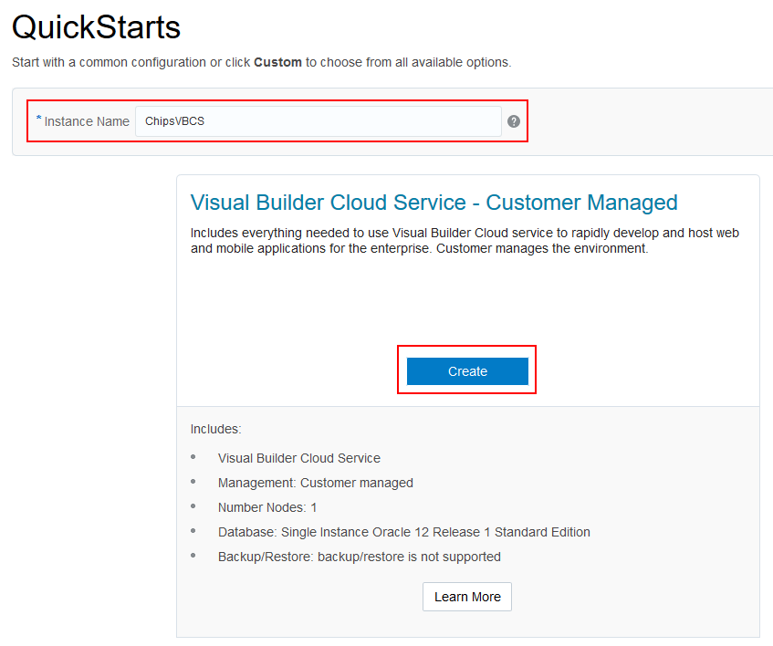
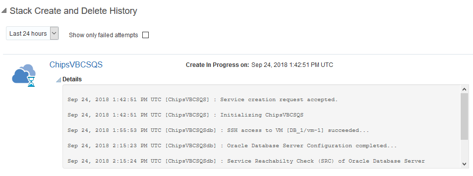
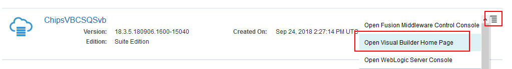

# Lab 100 - Creating a Visual Builder Application and Displaying Business Data

## Introduction

This is the first of several labs that are part of the **Oracle Autonomous Visual Builder Cloud Service Workshop.** During this workshop you will explore Oracle's Autonomous Visual Builder Cloud Service and its features from the persona of **Javascript Developer**, <add name>. You will follow <add name> as he creates a new web application, mobile application and links the mobile and web applications to the same business data in the Cloud. In our first lab you will create a Visual Builder application and add business data to display.

## Objectives

- Begin Creating a Web Application
  - Create application within Visual Builder user interface
  - Add business data for application to display
- Create the Application Pages
  - Create pages for displaying business data
  - Create pages for creating and editing business data

# Create an Application in Oracle Autonomous Visual Builder Cloud Service

### **STEP 1**: Login to your Oracle Cloud Account

- From any browser, go to the URL:
  `https://cloud.oracle.com`

- Click **Sign In** in the upper right hand corner of the browser and on the next screen enter you Cloud Account Name.


- Enter your User Name and Password provided for your trial account and click **Sign In**

    


- You will be presented with a Dashboard displaying the various cloud services available to this account.

  

- If the Visual Builder Cloud Service does not appear in your list click the customize dashboard button.

  

- Then select Visual Builder and click the show button.


- Your should see the following before proceeding to the next step.


### **STEP 2**: Create a New Instance

- At the top of the page select the **Guided Journey** link.


- Next Select the **Develop and Deploy** option.


- Fill out the form below selecting **Javascript** and **Web App**. Then press the **Create Visual Builder Instance** button.


- Name your instance and press create.



- Download your public/private keys when prompted by clicking the **Download** link on the prompt.


- You should see your instance being created.


- The page will show you the status of the stack creation.




- When you see the following screen you can proceed to the next step.


### **STEP 3**: Access the Oracle Autonomous Visual Builder Cloud Service

- Click on the **Hamburger** icon at the top of the page.


- Select **Visual Builder** from the navigation menu.


- On the next screen open the **Visual Builder Hompage**.




### **STEP 4**: Create Visual Application

- Click **New** to start the application create wizard.

  

- On Details screen enter the following data and click on **Next**.

  In the Create Application dialog box, enter the following, then press **Create**.

  - **Application Name:** ```Application```
  - **Description:** ```Tutorial Application```
  - **Application ID:** The text field is automatically populated as you type based on the Application Name.

    

- **NOTE:** _If you receive a browser warning please update/change your browser to a compatible version._


- You now have a new application, in which you can begin building pages and adding data.

  

# Import Business Data

### **STEP 1**: Import Files containing business data

#### Create Business Objects by Importing the Inventory Data

In this step we will create a new business object to host data for our application.

- Open the **Business Objects** by clicking on the "Business Objects" icon in the navigation panel.


- Click the "menu" icon and select "Data Manager" from the dropdown to open the import tool.


- Now we'll import the Inventory data from a file. In the right hand pane select the **Import Business Objects** window.

  

- Download this spreadsheet <a href="/avbcsMisc/inventory.xlsx" target="new">inventory.xlsx</a> to your local machine. When prompted upload this file to create a new business object.


- You will see a popup stating that the upload is taking place and it will confirm that the upload finished with a message stating "Upload succeeded."

  

- Click **Next**


- The business objects will be displayed with the option to edit the names, we will be leaving the names as they are and click **Next**.

  

- The next step will display the fields that will be created and will detect the data types and set them accordingly. You can edit the names and types here but we will be leaving them as they are imported. Click **Finish**.

  

- Once the import is finished, you will receive a message showing the business objects that have been imported. Click the **Close** button.

  

- You should now see the **inventory** and **variant** business objects in the panel on the left. Click on the **inventory** Business Object.

  

- You will see the details of the business object in the right hand panel.


### **STEP 2:** Creating the Web App

Now that we have data for our app to display we can build our web app to display and modify that data.

- Click on the **monitor** icon in the left panel to open the web apps panel. Then click on the "+ Web Application" button to create a new web app.

  

- Name your app "InventoryWebApp" and click **Create**.

  

- Your applications canvas will open. This is where we will begin adding components to the page. You can expand the drop downs in the left panel to see where the main-start page is in the structure of the app.

  

- To begin, we'll add a list to our page to display our added inventory data. Scroll down in the components list panel and drag a **List View** onto our page.

  

- To associate our inventory data with the list, in the right panel select **Add Data**.

  

(If you DO NOT see **Add Data** you may need to expand the right panel or click on the **Quick Add** icon in the "List View" panel, highlighted below)


- There are several steps for selecting data for our list. To select the endpoint expand Business Objects > Inventory and select the GET /Inventory entry, then click Next.


  - For **Choose Template** we will use the default template which is at the top of the list and then click **Next**.

  

  - For our **Fields** we will select data from the **Endpoint Structure** and drag them into the **Fields** boxes.

    - "title1": name
    - "title2": variant
    - "value1": quantity
    - "value2": reserved


  

  Your screen should look like the following before you click **NEXT**:

  

- We don't need to define a query for our data, so we can click **Finish**.

  

- At this point we have an application that will display our data and we can look at the the live app by clicking on the **Play** button in the top right corner.

  

- We have created a simple app to display our wine inventory...


  

Our app is displaying our data but our inventory/reserved counts aren't labeled. Let's add labels so users will know what these numbers mean. To do that we can customize the data displayed in our list view.

- Leave the live view and return to the design view of your app. Select an item in the list so that it is highlighted with a blue border and a **List Item** tag.

  

- In the detail panel on the right side, select the **General** tab.


- We can add our label to the data in the fields. We add the label as a quoted string inside the double square brackets. So the data in the "Value1" field will contain the following

  `[["Inventory: " + $current.data.quantity]]`

  and the "Value2" field will have:

  `[["Reserved: " + $current.data.reserved]]`
  
  


* Now our app displays a list of the available wines with their inventory count and reserved count.

  

# Summary

We have now created an application in Autonomous Visual Builder Cloud Service, added our business data. The next lab in the series will guide us through adding update and edit features to allow the app's users to update inventory counts from the app.
