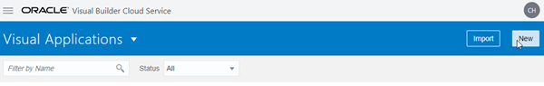
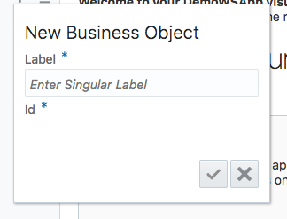
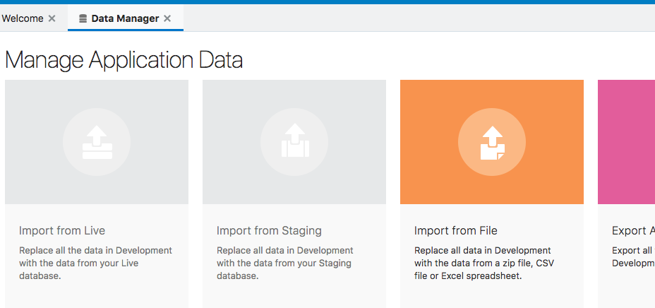
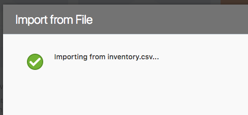
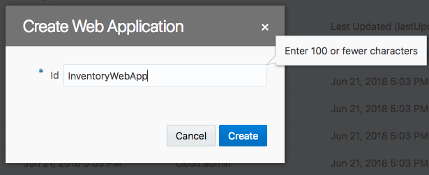
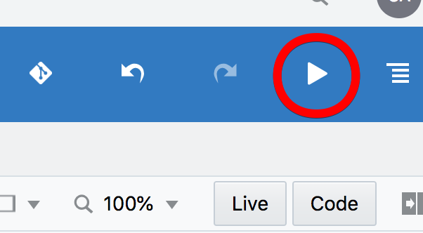

  
Updated: February 10, 2017

## Introduction

This is the first of several labs that are part of the **Oracle Autonomous Visual Builder Cloud Service workshop.** This workshop will walk you through creating applications for web and mobile from the browser using a visual development environment.

You will take on 2 Personas during the workshop. The **Javascript Developer Persona** will create the web application and add the associated business data. The Javascript Developer will then create the mobile application and link it to the web applications existing business data. The **IT Security Analyst Persona** will implement access controls in the applications and configure user accounts to allow access to the applications. During the workshop, you will get an overview of Oracle Autonomous Visual Builder Cloud Service and some of its features.

**_To log issues_**, click here to go to the [github oracle](https://github.com/oracle/learning-library/issues/new) repository issue submission form.

## Objectives

- Creating a Web Application
  - Create application within Visual Builder user interface
  - Add busines data for application to display
- Create Application Pages
  - Create pages for displaying business data
  - Create pages for creating and editing business data

## Required Artifacts

- The following lab requires an Oracle Public Cloud account that will be supplied by your instructor.

# Create an Application in Visual Builder Cloud Service

### **STEP 1**: Login to your Oracle Cloud Account

- From any browser, go to the URL:
  `https://cloud.oracle.com`

- click **Sign In** in the upper right hand corner of the browser

  

- **IMPORTANT** - Under my services, select from the drop down list the correct data center and click on **My Services**. If you are unsure of the data center you should select, and this is an in-person training event, **_ask your instructor_** which **Region** to select from the drop down list. If you received your account through an Oracle Trial, your Trial confirmation email should provide a URL that will pre-select the region for you.

  

- Enter your identity domain and click **Go**.

  **NOTE:** The **Identity Domain, User Name** and **Password** values will be given to you by the instructor or Trial confirmation email.

  

- Once your Identity Domain is set, enter your User Name and Password and click **Sign In**

  **NOTE:** For this lab you will assume the role of Javascript Developer **_Lisa Jones_**. Although you are assuming the identify of Lisa Jones, you will log into the account using the **username** provided to you by your instructor, given to you by your corporation, or supplied to you as part of an Oracle Trial. As you progress through the workshop, you will remain logged in as a single user, but you will make “logical” changes from Lisa Jones the Javascript Developer to other personas.

  

  

- You will be presented with a Dashboard displaying the various cloud services available to this account.

  

- If all your services are not visible, **click** on the **Customize Dashboard**, you can add services to the dashboard by clicking **Show.** For this workshop, you will want to ensure that you are showing at least the **Application Container, Developer and Storage** cloud services. If you do not want to see a specific service, click **Hide**

  

### **STEP 2**: Access the Oracle Autonomous Visual Builder Cloud Service

Oracle Autonomous Visual Builder Cloud Service provides an easy way to
create and host web and mobile applications in a secure cloud
environment. An intuitive visual development experience on top of a
complete development and hosting platform accelerates application
creation and provisioning, leveraging an open, standard-based
architecture.

- From the Cloud UI dashboard click on the **Visual Builder** service.

  

- The Service Details page gives you a quick glance of the service status overview.

  

- Click **Open Service Console** for the Oracle Visual Builder Cloud Service. The Service Console will then list all Visual Applications.

  

### **STEP 4**: Create Visual Application

- Click **New** to start the application create wizard.

  

- On Details screen enter the following data and click on **Next**.

  In the Create Application dialog box, enter the following.

  - Application name: Application
  - Description: Tutorial application

  - The Application ID text field is automatically populated as you type based on the Application Name.
    

- You now have a new application, in which you can begin building pages and adding data.

  

# Import Business Data

### **STEP**: Import Files containing business data

#### Create Inventory Business Object and Import the Inventory Data

In this step you are assuming the identity of the Javascript, **_Lisa Jones_**.

- First we will import some data for our application to display. Click on the "hamburger" icon in the left panel to open the "Business Objects" panel and click the "menu icon next to the plus sign and click "Data Manager" to open the import tool.

  

- A box will appear where you will enter the label for your new business object. Enter "Inventory" and click the check mark. (the Id field is automatically populated based on the label you provide)

  

- In order to import the data to our business object the fields need to be created for the data to be placed into. Click the **Fields** tab, then click the **+ New Field** button. Here well add our fields to the auto generated fields.

  

- For our first field enter name and select the **A** icon to set its field type as a string, then click the **check mark**.

  

- Add the following fields and set their types:

  - variant, string
  - year, number
  - quantity, number
  - reserved, number

- Now we'll import the Inventory data from a file. Click on the **Data Manager** entry in the **Business Object** menu.

  

- Click **Import from File** and use the provided "Inventory.csv" file to import the data.

  

- You will see a popup stating that the import is taking place and it will confirm with a green check mark once the import is complete. (if there are any errors you may need to check your field names in the **Fields** tab against the headings in the provided CSV file and make sure they match)

  

- You can go back to the **Data** tab of the Inventory business object to verify or edit the data imported.

#### Create Variant Business Object and Import the Variant Data

- Now we will do the same process for bringing the variant data into the app. You can review the process we just completed for the inventory data if you need a reference.
- Create a new business object called "Variant" and add the following fields with the specified types:

  - type, string
  - variant, string

- Return to the **Data Manager** and import data from the **variant** file. We will import the data for the Variant business object. Visual Builder will know which business object to associate the data with by the file name of the data file, so make sure the file name matches the name of the business object.

- Check the **Data** tab of the Variant business object to see the imported data.

### **STEP Creating the Web App**:

Now that we have data for our app to display we can build our web app to display and modify that data.

- Click on the **monitor** icon in the left panel to open the web apps panel. Then click on the "+ Web Application" button to create a new web app.

  

- Name your app "InventoryWebApp" and click **Create**.

  

- Your applications canvas will open. This is where we will begin adding components to the page. You can expand the drop downs in the left panel to see where this page is in the structure of the app.

  

- To begin, we'll add a list to our page to display our added inventory data. scroll down in the components list panel and drag a **List View** onto our page.

  

- To associate our inventory data with the list, in the right panel select **Add Data**. (If you DO NOT see **Add Data** you may need to expand the right panel or click on the **Quick Add** icon in the "List View" panel, highlighted below)

  

- There are several steps for selecting data for our list:

  - For **Select Endpoint** expand **Business Objects** > **Inventory** and select the **GET /Inventory** entry, then click **Next**.

  

  - For **Choose Template** we will use the default template which is at the top of the list and then click **Next**.

  

  - For our **Fields** we will select data from the **Endpoint Structure** and drag them into the **Fields** boxes. Drag the following items into the listed Field and then click **Next**:
    - "title1": name
    - "title2": variant
    - "value1": quantity
    - "value2": reserved

  

- We don't need to define a query for our data, so we can click **Finish**.

- At this point we have an application that will display our data and we can look at the the live app by clicking on the **Play** button in the top right corner.

  

  - We have created a simple app to display our wine inventory...

  

Our app is displaying our data but our inventory/reserved counts aren't labeled. Let's fix that so users will know what these numbers mean. To do that we can customize the data displayed in our list view.

- Leave the live view and return to the design view of your app. Select an item in the list so that it is highlighted with a blue border and a **List Item** tag.

  

- In the detail panel on the right side, select the **General** tab. We can add our label to the data in the fields. We add the label as a quoted string inside the double square brackets. So the data in the "Value1" field will contain the following

  `[["Inventory: " + $current.data.quantity]]`

  and the "Value2" field will have:

  `[["Reserved: " + $current.data.reserved]]`

* Now our app displays a list of the available wines with their inventory count and reserved count.

  

# Add Create and Edit Pages

Now that we have a display of our data, the next step is to allow additions and edits to that data. This will allow users to add new wines as they become available and edit the inventory/reserved counts. Oracle Autonomous Visual Builder makes this very easy with the **Quick Start** menu we accessed earlier.

- In the **Designer View** of our app, click inside the list component but outside an individual item so that the List is selected and the **List View** tag is displayed.

- This will allow you to access the **Quick Start** icon and menu where we'll select **Add Create Page**.

- This will bring up the **Add Create Page**. For the first step, we will leave the endpoint set as **POST /Inventory** and click **Next**. This will bring us to the **Page Detail** step where we can select the fields we would like to make available for creating new records. We'll select the following:

  - name
  - variant
  - inventory
  - reserved

- Also adjust the **Button Label** to simply "Create" and click **Finish**.

  

- You will be presented with the main page of the app again. In order to view the new Create Page click the icon to expand the left panel, select the monitor icon which represents web apps, and if you have not expanded the app's layout expand **InventoryWebApp** > **flows** > **main** and select **CreateInventory**.

  

With this page created we can toggle live mode right in the app editor to interact with the app and add data. To enable live mode, click the **Live** button above the right side panel.

- Once in live mode, enter a new wine and click **Save**.(The save may take a few seconds, you'll know it's finished when you see the following screen and a notification that the save completed) You can enter your favorite wine or use the following example:

  - name: Ice
  - variant: white
  - quantity: 50
  - reserved: 0

  

  

- To view our new entry let's go back to our apps main page, which you can access in the left side panel or in the tabs at the top of the page if you have not closed it. (Don't forget to exit live mode when you go back to the **CreateInventory** page designer by clicking on the "Play" arrow button.)

  

- Back in the **main-start** page you'll see our new entry is added to the list, and also note that there is a new **Create** button which was added for us by using the **Quick Start** guide to make our new create page. This is a major advantage to using the quick start guide for creating new pages, it will make buttons for us that will link to our new pages.

- Now lets use the **Quick Start** guide to add an **Edit** page and a **Delete** button to our app's main page. Once again, click on the **List** component outside of a specific item so that the **List View** tag appears.

  

- Now the **List View** detail panel should be displayed on the right. Click on the **Quick Start** icon and we'll see the links to add pages. This time we'll add an **Edit** page. This will allow users to edit the inventory and reserve counts of the items. Click on **Add Edit Page** in the right panel.

  - 

- On the **Select Read Endpoint** page we'll leave the default endpoint selected (GET /Inventory/{Inventory_Id}), and click **Next**. On the next step we'll leave the **Select Update Endpoint** set as the default (PATCH /Inventory/{Inventory_Id}) and click **Next**.

- In the **Page Details** step we'll select the fields we want displayed on our edit page, and then click **Finish**. Here we'll select:

  - Name
  - Variant
  - Quantity
  - Reserved

  

- Now if we go back to our "Main-start" page and again enter **Live** mode by clicking the "Live" button above the right panel we can test our edit page. Click on a list entry and the the **Edit Inventory** button will become active. Click on the **Edit Inventory** button to go to our new edit page we just created.

  

- This section of the web app will allow users to update items with new counts as they become available. If you would like to test the edit functionality, change a count and press save, otherwise just press cancel to return to the **main-start** page. Remember to exit **Live** mode by clicking the "Live" button in the top right.

- If we go back to our **main** tab we can now see our apps structure:

# Summary

We have now created an application in Autonomous Visual Builder Cloud Service, added our business data, and added pages to display, add to, and edit our data all with very little need for code.
