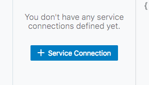
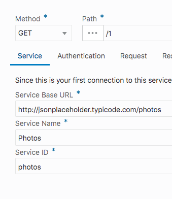
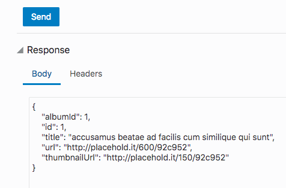
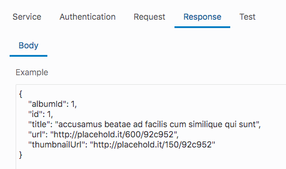
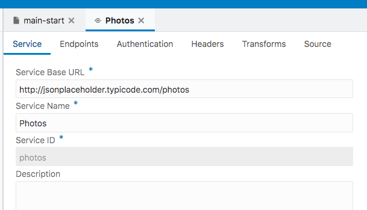

  
Updated: July 10, 2018

## Introduction

This lab is one of a series which provides an overview of Oracle Autonomous Visual Builder Cloud Service(VBCS).

**_To log issues_**, click here to go to the [github oracle](https://github.com/oracle/learning-library/issues/new) repository issue submission form.

## Objectives

- Add a REST Service Connection to the application
- Incorporate data retrieved from Service Connection into application
- Create a mobile page for viewing inventory item details

## Required Artifacts

- This lab assumes that you have completed the previous labs in this series and created the items covered in those labs. If you have not, download the `DemoWSApp_MobileLabImport_2.zip` file and after creating an application in VBCS(instructions found in lab 100), import the zip file provided to set up the items created in the previous labs.

# Add REST Service Connection

### **STEP 1**: Create Service Connection

- If you are not already, log in to the Visual Builder Cloud Service(instructions on how to do so are in Lab 100)

- In your application development console, click on **Service Connections** icon in the far left panel. It is the icon that looks like a circle with a line through it and is highlighted blue in the image below.

  

- Click the button **"+ Service Connection"** to create a new service connection instance.

  

- In the **Create Service Connection** window, we will choose **Define by Endpoint** as our source.

  

- Leave "GET" the **Method** dropdown menu. Next, enter the following address in the URL field:

  `http://jsonplaceholder.typicode.com/photos/1`

- Select "Retrieve One" in the **Action Hint** dropdown menu, then click **Next**. (For this example we will be doing a simple GET request returning one record)

  

- You'll see on the next screen that AVBCS populates some fields with information from the address we have provided. The **Service Name** and **Service ID** are filled in for us.

  

- Click on the **Test** tab to try our connection and make sure it works. On the **Test** tab, click **Send** and review the data returned.

  

- If the data comes back successfully, click **Copy to Response Body** to inform VBCS of the response structure.

  

- Check the **Response** tab to see the response is now in the "Example" text area, then click **Create**.

  

- Once created, the development console will display the tab of the new service connection.

  

### **STEP 2**: Title of Step 2

- Instructions for Step 2
